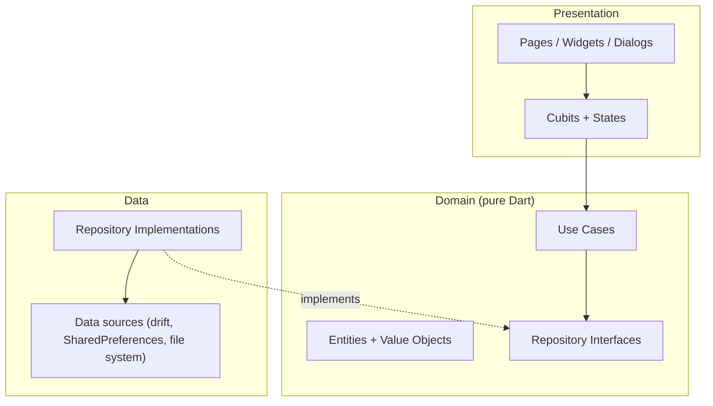
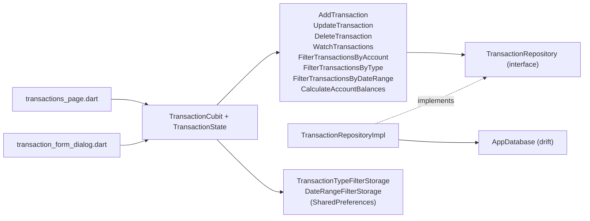
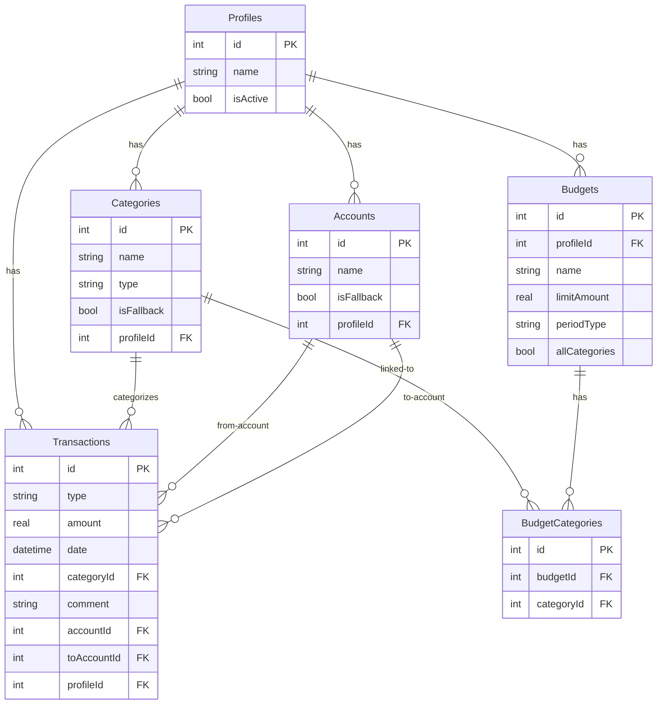
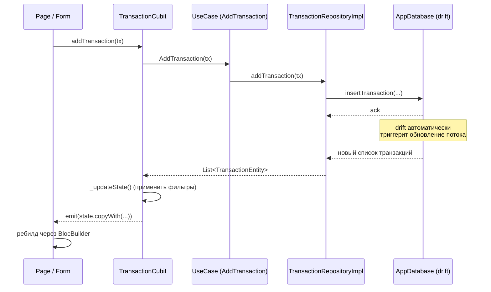

# Mango Balance

Кроссплатформенное Flutter-приложение для учёта личных финансов: ведение транзакций по счетам и категориям с поддержкой нескольких профилей, визуализация финансовых данных в виде графиков, контроль трат через систему бюджетов, импорт и экспорт данных в формате XLSX.

Документ описывает проект исчерпывающе: архитектуру, модель данных, реализованные функциональные модули, реактивный поток данных, паттерны работы с состоянием и решения, принятые при разработке. Документ построен так, чтобы по нему можно было ориентироваться в коде без чтения всех 100+ файлов исходников: для каждой темы указаны конкретные пути к файлам, где находятся детали реализации.

---

## Содержание

1. [Описание проекта](#1-описание-проекта)
2. [Возможности приложения](#2-возможности-приложения)
3. [Технологический стек](#3-технологический-стек)
4. [Архитектура](#4-архитектура)
5. [Структура проекта](#5-структура-проекта)
6. [Модель данных и схема БД](#6-модель-данных-и-схема-бд)
7. [Domain-сущности](#7-domain-сущности)
8. [Функциональные модули (features)](#8-функциональные-модули-features)
9. [Реактивный поток данных](#9-реактивный-поток-данных)
10. [Активный профиль и его влияние на состояние](#10-активный-профиль-и-его-влияние-на-состояние)
11. [Хранение UI-настроек](#11-хранение-ui-настроек)
12. [Графика и аналитика](#12-графика-и-аналитика)
13. [Бюджеты](#13-бюджеты)
14. [Импорт и экспорт XLSX](#14-импорт-и-экспорт-xlsx)
15. [Миграции БД](#15-миграции-бд)
16. [Сборка и запуск](#16-сборка-и-запуск)
17. [Описание экранов](#17-описание-экранов)
18. [Пользовательские сценарии](#18-пользовательские-сценарии)
19. [Скриншоты](#19-скриншоты)
20. [Соглашения по коду и git workflow](#20-соглашения-по-коду-и-git-workflow)
21. [Out of scope и направления развития](#21-out-of-scope-и-направления-развития)
22. [Справочные таблицы](#22-справочные-таблицы)

---

## 1. Описание проекта

**Mango Balance** — личный финансовый менеджер. Приложение позволяет пользователю:

- вести учёт доходов, расходов и переводов между собственными счетами;
- организовывать данные по категориям (отдельным для доходов и расходов);
- работать с несколькими изолированными финансовыми профилями (например, «Личное» и «Семейное»);
- визуализировать финансы через интерактивные графики (паевые круговые чарты по категориям, временной ряд столбчатой диаграммы по периодам);
- задавать бюджеты с лимитами трат на выбранные категории на повторяющиеся периоды (неделя / месяц / год) и наблюдать прогресс выполнения;
- импортировать существующие данные и экспортировать текущие из/в XLSX;
- фильтровать список транзакций по счёту, типу, диапазону дат с сохранением выбора между запусками.

Приложение полностью офлайн — все данные хранятся локально в SQLite-базе на устройстве пользователя.

### Целевая аудитория

Пользователи, ведущие учёт личных финансов вручную и желающие иметь полный контроль над данными без отправки их в сторонние сервисы. Поддерживаются как индивидуальные пользователи, так и пары/семьи (через систему профилей и бюджетов).

### Языковая локализация

Текст интерфейса в текущем состоянии: смесь русского и английского. Стандартные категории и счета создаются с русскими наименованиями (например, «Продукты питания», «Дебетовая карта»), системные строки UI — на английском («Add transaction», «No data», «Income vs Expenses»). Полноценная многоязычная локализация на момент написания документа не реализована.

---

## 2. Возможности приложения

### 2.1. Профили

Пользователь может создавать несколько финансовых профилей. Каждый профиль изолирован: имеет собственный набор счетов, категорий, транзакций и бюджетов. В любой момент времени активен ровно один профиль; переключение активного профиля приводит к мгновенной перезагрузке всех связанных данных в UI.

При создании нового профиля можно:

- автоматически наполнить его стандартным набором категорий и счетов («Продукты питания», «Транспорт», «Жилищные расходы», «Дебетовая карта», «Кредитная карта» и т. д.);
- начать с минимального набора (только fallback-категории и один счёт), наполняя его вручную.

Удаление профиля каскадно удаляет все его транзакции, счета, категории и бюджеты.

### 2.2. Счета

Счёт (Account) — это место хранения денег: банковская карта, наличные, накопительный счёт. Каждый счёт привязан к конкретному профилю. Среди счетов профиля один помечен как fallback — он автоматически создаётся при инициализации профиля и не может быть удалён напрямую (используется как «получатель» транзакций при удалении других счетов, чтобы не оставлять висящих ссылок).

Баланс счёта рассчитывается на лету как сумма всех приходных операций минус сумма расходных, плюс/минус переводы.

### 2.3. Категории

Категория (Category) — классификатор транзакции. У каждой категории есть один из трёх типов: `income`, `expense`, `transfer`. Категории привязаны к профилю. В каждом профиле существует ровно по одной fallback-категории каждого типа («Other (доходы)», «Other (расходы)», «Перевод»); они автоматически создаются вместе с профилем и не редактируемы. При удалении пользовательской категории все её транзакции автоматически перепривязываются к fallback-категории соответствующего типа, что гарантирует целостность данных.

### 2.4. Транзакции

Транзакция (Transaction) описывает финансовое движение и существует в трёх типах:

| Тип        | Описание                                   | Поля                                         |
|------------|--------------------------------------------|----------------------------------------------|
| `income`   | Доход                                      | счёт-получатель, категория-доход             |
| `expense`  | Расход                                     | счёт-источник, категория-расход              |
| `transfer` | Перевод между двумя счетами одного профиля | счёт-источник, счёт-получатель, fallback-категория «Перевод» |

Каждая транзакция содержит:

- сумму (положительное число с двумя знаками после запятой);
- дату (не позднее текущего момента — валидируется в value object);
- ссылку на категорию;
- ссылку на счёт-источник (`accountId`);
- ссылку на счёт-получатель (`toAccountId`) — для income/expense дублирует accountId, для transfer указывает целевой счёт;
- необязательный текстовый комментарий;
- ссылку на профиль.

#### Фильтры на экране транзакций

На экране транзакций доступны три параллельных фильтра, применяемых последовательно (логическое И):

1. **Фильтр по счёту** (выпадающий список): «Total» (все счета) либо конкретный счёт.
2. **Фильтр по типу** (три чекбокса): Income / Expense / Transfer. Минимум один должен оставаться включённым.
3. **Фильтр по диапазону дат** (один встроенный элемент с вызовом `showDateRangePicker`): «All time» либо явный диапазон. Обе границы включительно.

Фильтры по типу и по датам сохраняются между запусками через `SharedPreferences`. Фильтр по счёту — нет (сбрасывается на «Total» при перезапуске или смене профиля).

Фильтры влияют только на отображаемый список транзакций. Балансы (общий и по конкретному счёту) всегда вычисляются по полному набору данных активного профиля.

### 2.5. Статистика

Отдельный экран с графиками для активного профиля.

- **Селектор периода**: Day / Week / Month / Year / All time. По умолчанию — Week.
- **Навигатор периода**: для Day/Week/Month/Year — стрелки «назад/вперёд» переключают конкретный период. Назад ограничен датой первой транзакции; вперёд — текущим моментом. Для All time скрыт.
- **Donut-чарт «Income by category»**: распределение доходов в выбранном периоде. Сумма в центре, легенда снизу с категориями и процентами. При большом числе категорий — топ-6 + «Other».
- **Donut-чарт «Expenses by category»**: аналогично для расходов.
- **Time-series bar chart**: парные столбцы income/expense на каждый временной бакет от первой транзакции до сегодняшнего дня; прокрутка по горизонтали; гранулярность бакета совпадает с выбранным периодом (Day → ежедневные столбцы, Week → недельные, …). Для All time гранулярность автоматически становится годовой. Под чартом — суммарные Income / Expense / Net.

### 2.6. Бюджеты

Раздел «Budgets» — список бюджетов активного профиля с прогресс-барами. Каждый бюджет состоит из:

- имени;
- лимита (положительное число);
- периода (Week / Month / Year, recurring — сбрасывается каждый новый период автоматически);
- набора категорий (одна / несколько / все expense-категории).

Бюджет с флагом «All categories» автоматически включает в себя все expense-категории, в том числе те, что будут добавлены в будущем.

Прогресс рассчитывается на лету: сумма expense-транзакций активного профиля за текущий период по выбранным категориям. Внесение, изменение или удаление любой транзакции немедленно обновляет прогресс.

Цвет прогресс-бара зависит от заполненности:

- зелёный — менее 80 %;
- оранжевый — от 80 % до 100 %;
- красный — 100 % и выше (с подписью «Over by X»).

Сортировка списка — по убыванию заполненности (самые «горящие» сверху). Под каждым бюджетом отображается, сколько дней осталось до конца текущего периода.

Превышение лимита **не блокирует** создание новых транзакций — это намеренное решение.

### 2.7. Импорт и экспорт XLSX

- **Экспорт**: пользователь выбирает профиль (или несколько) и при необходимости диапазон дат, нажимает «Export» — приложение генерирует XLSX-файл с тремя/четырьмя листами (Profiles, Accounts, Categories, Transactions). На мобильных и десктопных платформах файл сохраняется через системный диалог; в web-сборке — скачивается в браузер.
- **Импорт**: пользователь выбирает XLSX-файл, диалог импорта парсит и валидирует его содержимое, затем переносит в новый или выбранный профиль. Поддерживаются файлы, экспортированные самим приложением; формат файла подробно описан в разделе 14.

### 2.8. Управление профилями, счетами, категориями

Каждая из этих сущностей имеет собственный CRUD-экран в боковом меню:

- **Profiles**: создание (с выбором, наполнять ли стандартными данными), переименование, переключение активного, удаление.
- **Accounts**: создание, редактирование, удаление (с автоматическим переносом транзакций на fallback-счёт).
- **Categories**: создание (с выбором income/expense), редактирование, удаление (с автоматическим переносом транзакций на fallback-категорию соответствующего типа).

Fallback-сущности (`isFallback = true`) защищены от редактирования и удаления.

---

## 3. Технологический стек

| Технология              | Версия (на момент написания) | Назначение                                                        |
|-------------------------|------------------------------|-------------------------------------------------------------------|
| Flutter SDK             | ≥ 3.8.1                      | Кроссплатформенный UI-фреймворк                                   |
| Dart                    | 3.x                          | Язык программирования                                             |
| `flutter_bloc`          | ^8.1.3                       | Управление состоянием (паттерн BLoC/Cubit)                        |
| `drift`                 | ^2.17.0                      | Type-safe ORM поверх SQLite с реактивными запросами               |
| `drift_dev`             | ^2.17.0 (dev)                | Кодогенерация для drift                                           |
| `build_runner`          | ^2.4.8 (dev)                 | Запуск кодогенераторов                                            |
| `sqlite3_flutter_libs`  | ^0.5.0                       | Бинарники SQLite для всех платформ                                |
| `path_provider`         | ^2.1.2                       | Получение системных путей (для размещения файла БД)               |
| `path`                  | ^1.9.0                       | Кроссплатформенная работа с путями                                |
| `get_it`                | ^9.2.1                       | Service Locator — DI-контейнер                                    |
| `fl_chart`              | ^0.69.0                      | Библиотека графиков (donut, bar)                                  |
| `shared_preferences`    | ^2.2.2                       | Простое key-value хранилище для UI-настроек                       |
| `excel`                 | ^4.0.6                       | Парсинг и генерация XLSX-файлов                                   |
| `file_picker`           | ^8.1.2                       | Системный диалог выбора файла для импорта                         |
| `cupertino_icons`       | ^1.0.8                       | Набор iOS-иконок                                                  |
| `flutter_lints`         | ^5.0.0 (dev)                 | Стандартные правила анализатора Dart/Flutter                      |

### Обоснование выбора технологий

- **Flutter** — единая кодовая база для Android, iOS, macOS, Windows, Linux и web. Декларативный UI, хорошая производительность, активное сообщество.
- **drift** выбран вместо «голого» `sqflite` потому, что обеспечивает type-safe DSL для запросов, автоматическую миграцию, реактивные `Stream`-запросы (которые автоматически переэмитятся при изменении затронутых таблиц) и поддержку join'ов с типобезопасным маппингом результатов.
- **flutter_bloc** (Cubit) выбран вместо `setState`/`Provider`/`Riverpod`/`MobX`, потому что:
  - Cubit — простая и предсказуемая модель: «функция вход состояние → новое состояние», без сложной логики reducer'ов;
  - чёткое разделение состояния, событий и UI;
  - удобно подменять поток-источник при смене активного профиля;
  - встроенная интеграция с `BlocBuilder`, `BlocProvider`, `MultiBlocProvider`.
- **get_it** выбран вместо `Provider`/`Riverpod` для DI как самый лёгкий и явный service locator. Регистрация всех зависимостей сосредоточена в одном файле [`lib/core/di/injector.dart`](lib/core/di/injector.dart).
- **shared_preferences** для UI-настроек выбран вместо хранения в SQLite, потому что они не относятся к доменным данным (фильтры списка), не нуждаются в реляционных запросах и не должны зависеть от профиля.
- **fl_chart** — самая популярная библиотека Flutter-графиков с открытым API, поддержкой кастомизации и достаточным набором типов чартов.
- **excel** + **file_picker** — стандартный путь чтения/записи XLSX и выбора файлов в Flutter.

---

## 4. Архитектура

Проект организован по принципам **Clean Architecture (Uncle Bob)** с явным разделением на три слоя:



### 4.1. Принципы

- **Зависимости направлены к Domain.** Domain не зависит ни от Presentation, ни от Data — это чистый Dart без импорта Flutter в большинстве случаев. Presentation и Data зависят от Domain.
- **Use cases — точки входа доменной логики.** Cubit вызывает не репозиторий напрямую, а соответствующий use case (например, `AddTransaction`, `WatchBudgets`). Use case — это, как правило, тонкая обёртка вида «принять параметры → дернуть метод репозитория», но иногда содержит бизнес-логику (например, [`BuildBudgetsProgress`](lib/features/budgets/domain/usecases/build_budgets_progress.dart) сводит транзакции, бюджеты и категории в список `BudgetProgress`).
- **Репозиторий определяется интерфейсом в Domain, реализуется в Data.** В Data-слое находится конкретный класс, использующий drift или другой источник данных и маппинг между БД-моделью и доменной сущностью.
- **Value objects инкапсулируют инварианты.** Например, [`Amount`](lib/features/transactions/domain/value_objects/amount.dart) не позволяет создать сумму ≤ 0; [`TransactionDate`](lib/features/transactions/domain/value_objects/transaction_date.dart) запрещает дату из будущего.
- **State management — через Cubit.** Каждый feature имеет свой `*_cubit.dart` и `*_state.dart`. Состояние неизменяемо (immutable); все обновления — через `emit(state.copyWith(...))`.
- **DI собран в одном месте.** Все зависимости регистрируются в `setupDependencies()` в [`lib/core/di/injector.dart`](lib/core/di/injector.dart). Cubits регистрируются через `registerFactory` (новый экземпляр на каждый запрос — ассоциируется с виджетом-владельцем); репозитории и use cases — через `registerLazySingleton` (один на приложение).

### 4.2. Слойная карта на примере фичи Transactions



### 4.3. Внутренняя структура одной фичи

Каждая фича в `lib/features/<name>/` следует одному и тому же шаблону:

```
<name>/
├── domain/
│   ├── entities/         — value objects и доменные сущности
│   ├── repositories/     — интерфейсы репозиториев
│   └── usecases/         — use cases (по одному файлу на use case)
├── data/
│   ├── datasources/      — обёртки для нерепозиторных источников (например, SharedPreferences) — опционально
│   └── repositories/     — реализации интерфейсов из domain
└── presentation/
    ├── cubit/            — `*_cubit.dart` + `*_state.dart`
    ├── pages/            — экраны (Scaffold-уровневые виджеты)
    └── widgets/          — формы, диалоги, кастомные виджеты
```

Не все фичи используют все папки; например, у Statistics нет data-слоя, потому что она работает только с уже потоковыми данными из других фич.

---

## 5. Структура проекта

Дерево исходников (`.g.dart` файлы и сгенерированный код опущены):

```text
mango_balance/
├── android/                  — Android-проект (нативный)
├── ios/                      — iOS-проект (нативный)
├── linux/  macos/  windows/  — десктопные проекты
├── web/                      — web-сборка
├── lib/
│   ├── main.dart             — точка входа, MaterialApp, маршруты, MultiBlocProvider
│   ├── core/
│   │   ├── database/
│   │   │   ├── app_database.dart      — drift-схема, миграции, методы доступа
│   │   │   └── app_database.g.dart    — сгенерированный код drift
│   │   ├── di/
│   │   │   └── injector.dart          — регистрация всех зависимостей в get_it
│   │   ├── enums/
│   │   │   └── transaction_type.dart  — enum income/expense/transfer
│   │   └── services/
│   │       └── active_profile_holder.dart — реактивный holder идентификатора активного профиля
│   ├── features/
│   │   ├── accounts/
│   │   │   ├── data/repositories/account_repository_impl.dart
│   │   │   ├── domain/
│   │   │   │   ├── entities/account.dart
│   │   │   │   ├── repositories/account_repository.dart
│   │   │   │   └── usecases/{add,update,delete,watch}_account.dart
│   │   │   └── presentation/
│   │   │       ├── cubit/{account_cubit, account_state}.dart
│   │   │       ├── pages/accounts_page.dart
│   │   │       └── widgets/account_form_dialog.dart
│   │   ├── budgets/
│   │   │   ├── data/repositories/budget_repository_impl.dart
│   │   │   ├── domain/
│   │   │   │   ├── entities/{budget, budget_period, budget_progress}.dart
│   │   │   │   ├── repositories/budget_repository.dart
│   │   │   │   └── usecases/{add,update,delete,watch}_budget.dart
│   │   │   │              + build_budgets_progress.dart
│   │   │   └── presentation/
│   │   │       ├── cubit/{budget_cubit, budget_state}.dart
│   │   │       ├── pages/budgets_page.dart
│   │   │       └── widgets/{budget_form_dialog, budget_progress_card}.dart
│   │   ├── categories/
│   │   │   └── (та же структура: data / domain / presentation)
│   │   ├── export/
│   │   │   ├── data/
│   │   │   │   ├── file_writers/file_writer_{io,web,stub}.dart
│   │   │   │   ├── file_writers/xlsx_file_saver.dart
│   │   │   │   └── repositories/export_repository_impl.dart
│   │   │   ├── domain/
│   │   │   │   ├── entities/{export_options, export_result}.dart
│   │   │   │   ├── repositories/export_repository.dart
│   │   │   │   └── usecases/build_xlsx_export.dart
│   │   │   └── presentation/
│   │   │       ├── cubit/{export_cubit, export_state}.dart
│   │   │       └── widgets/export_dialog.dart
│   │   ├── import/
│   │   │   ├── data/
│   │   │   │   ├── parsers/xlsx_import_parser.dart
│   │   │   │   └── repositories/import_repository_impl.dart
│   │   │   ├── domain/
│   │   │   │   ├── entities/{import_result, parsed_import}.dart
│   │   │   │   ├── repositories/import_repository.dart
│   │   │   │   └── usecases/{parse_xlsx_file, import_to_profile}.dart
│   │   │   └── presentation/
│   │   │       ├── cubit/{import_cubit, import_state}.dart
│   │   │       └── widgets/import_dialog.dart
│   │   ├── profiles/
│   │   │   └── (структура аналогична categories: data / domain / presentation)
│   │   ├── shared/
│   │   │   └── widgets/app_drawer.dart  — общий drawer навигации
│   │   ├── statistics/
│   │   │   ├── domain/
│   │   │   │   ├── entities/{period_type, period_range, period_bucket,
│   │   │   │   │             category_breakdown, statistics_snapshot}.dart
│   │   │   │   └── usecases/{compute_period_range, build_category_breakdown,
│   │   │   │               build_time_series, build_statistics_snapshot}.dart
│   │   │   └── presentation/
│   │   │       ├── cubit/{statistics_cubit, statistics_state}.dart
│   │   │       ├── pages/statistics_page.dart
│   │   │       └── widgets/{period_selector, period_navigator,
│   │   │                    category_donut_chart, time_series_bar_chart,
│   │   │                    chart_palette}.dart
│   │   └── transactions/
│   │       ├── data/
│   │       │   ├── datasources/{transaction_type_filter_storage,
│   │       │   │                date_range_filter_storage}.dart
│   │       │   └── repositories/transaction_repository_impl.dart
│   │       ├── domain/
│   │       │   ├── entities/transaction.dart
│   │       │   ├── value_objects/{amount, transaction_date}.dart
│   │       │   ├── repositories/transaction_repository.dart
│   │       │   └── usecases/{add,update,delete,watch}_transaction.dart
│   │       │              + filter_transactions_by_{account,type,date_range}.dart
│   │       │              + calculate_account_balances.dart
│   │       └── presentation/
│   │           ├── cubit/{transaction_cubit, transaction_state}.dart
│   │           ├── helpers/transaction_section_builder.dart
│   │           ├── pages/transactions_page.dart
│   │           └── widgets/transaction_form_dialog.dart
├── test/                     — модульные тесты (пусто на текущий момент)
├── pubspec.yaml              — описание пакета и зависимости
├── analysis_options.yaml     — настройки анализатора Dart
├── CLAUDE.md                 — инструкции для AI-ассистента (внутренний документ разработки)
└── README.md                 — данный документ
```

---

## 6. Модель данных и схема БД

База данных — **SQLite**, доступ через **drift**. Файл БД хранится в каталоге документов приложения: `<app-documents>/db.sqlite`.

Схема описана в [`lib/core/database/app_database.dart`](lib/core/database/app_database.dart). Таблицы являются классами Dart, наследующими `Table`; drift генерирует data-классы, companion-классы (для вставки/обновления) и SQL-схему автоматически в `app_database.g.dart`.

### 6.1. ER-диаграмма



### 6.2. Таблицы

#### `Profiles`

| Поле       | Тип    | Описание                                  |
|------------|--------|-------------------------------------------|
| `id`       | INT PK | Автоинкремент                             |
| `name`     | TEXT   | Имя профиля                               |
| `isActive` | BOOL   | Признак активного профиля; по факту в любой момент `true` ровно у одного |

Метод `setActiveProfile(id)` в одной транзакции сбрасывает флаг у всех профилей и устанавливает у указанного.

#### `Categories`

| Поле         | Тип    | Описание                                                      |
|--------------|--------|---------------------------------------------------------------|
| `id`         | INT PK | Автоинкремент                                                 |
| `name`       | TEXT   | Имя категории                                                 |
| `type`       | TEXT   | `income` / `expense` / `transfer`                             |
| `isFallback` | BOOL   | Защищает от удаления и редактирования; ровно по одной такой каждого типа на профиль |
| `profileId`  | INT FK | Ссылка на `Profiles(id)` с дефолтом `1` (для совместимости с миграциями) |

#### `Accounts`

| Поле         | Тип    | Описание                                                  |
|--------------|--------|-----------------------------------------------------------|
| `id`         | INT PK | Автоинкремент                                             |
| `name`       | TEXT   | Имя счёта                                                 |
| `isFallback` | BOOL   | Один fallback-счёт на профиль                             |
| `profileId`  | INT FK | Ссылка на `Profiles(id)`                                  |

#### `Transactions`

| Поле          | Тип    | Описание                                                      |
|---------------|--------|---------------------------------------------------------------|
| `id`          | INT PK | Автоинкремент                                                 |
| `type`        | TEXT   | `income` / `expense` / `transfer`                             |
| `amount`      | REAL   | Положительное число; знак выводится из `type` при отображении |
| `date`        | DATETIME | Дата транзакции (валидируется ≤ now)                        |
| `categoryId`  | INT FK | Ссылка на `Categories(id)`                                    |
| `comment`     | TEXT?  | Опциональный комментарий                                      |
| `accountId`   | INT FK | Счёт-источник (`@ReferenceName('fromTransactions')`)          |
| `toAccountId` | INT FK | Счёт-получатель (`@ReferenceName('toTransactions')`); для income/expense равен `accountId` |
| `profileId`   | INT FK | Ссылка на `Profiles(id)`                                      |

#### `Budgets`

| Поле            | Тип    | Описание                                                |
|-----------------|--------|---------------------------------------------------------|
| `id`            | INT PK | Автоинкремент                                           |
| `profileId`     | INT FK | Ссылка на `Profiles(id)`                                |
| `name`          | TEXT   | Имя бюджета                                             |
| `limitAmount`   | REAL   | Лимит, > 0                                              |
| `periodType`    | TEXT   | `week` / `month` / `year`                               |
| `allCategories` | BOOL   | Если `true` — таблица `BudgetCategories` для этого бюджета не используется; учитываются все expense-категории на лету |

#### `BudgetCategories`

Junction-таблица «многие-ко-многим» между `Budgets` и `Categories`:

| Поле         | Тип    | Описание                       |
|--------------|--------|--------------------------------|
| `id`         | INT PK | Автоинкремент                  |
| `budgetId`   | INT FK | Ссылка на `Budgets(id)`        |
| `categoryId` | INT FK | Ссылка на `Categories(id)`     |

При удалении бюджета все его записи в `BudgetCategories` удаляются в одной транзакции. При удалении категории все её записи в `BudgetCategories` тоже удаляются — это сделано в [`AppDatabase.deleteCategory`](lib/core/database/app_database.dart) для поддержания целостности (FOREIGN KEY ограничения у SQLite по умолчанию выключены).

### 6.3. Целостность

Поскольку SQLite в drift по умолчанию работает без активированных FK-ограничений, целостность поддерживается на уровне Dart-кода в `AppDatabase`:

- При удалении категории её транзакции переходят на fallback-категорию (`replaceCategoryForTransactions`), и записи в `BudgetCategories` чистятся.
- При удалении счёта его транзакции переходят на fallback-счёт (`replaceAccountForTransactions`).
- При удалении профиля каскадно (в одной транзакции) удаляются все его транзакции, счета, категории, бюджеты и связанные с бюджетами записи в `BudgetCategories`.
- Fallback-сущности нельзя удалить — это проверяется в репозиториях.

---

## 7. Domain-сущности

В этом разделе перечислены все доменные сущности с описанием полей и инвариантов. Все они расположены в `lib/features/<feature>/domain/entities/`.

### 7.1. `Profile` ([`lib/features/profiles/domain/entities/profile.dart`](lib/features/profiles/domain/entities/profile.dart))

- `int id`
- `String name`
- `bool isActive`

### 7.2. `AccountEntity` ([`lib/features/accounts/domain/entities/account.dart`](lib/features/accounts/domain/entities/account.dart))

- `int id`
- `String name`
- `bool isFallback`

### 7.3. `CategoryEntity` ([`lib/features/categories/domain/entities/category.dart`](lib/features/categories/domain/entities/category.dart))

- `int id`
- `String name`
- `TransactionType type` — `income` или `expense` (по бизнес-смыслу UI-формы для редактирования не позволяют завести категорию с типом `transfer` — fallback-категория этого типа создаётся автоматически).
- `bool isFallback`

### 7.4. `TransactionEntity` ([`lib/features/transactions/domain/entities/transaction.dart`](lib/features/transactions/domain/entities/transaction.dart))

- `int id`
- `TransactionType type`
- `Amount amount` — value object с инвариантом `value > 0`.
- `TransactionDate date` — value object с инвариантом `value <= now`.
- `int categoryId`, `String categoryName` — id и денормализованное имя для отображения.
- `int accountId`, `String accountName`
- `int? toAccountId`, `String? toAccountName` — для transfer обязательны, для income/expense равны источнику.
- `String? comment`

Метод `copyWith` для иммутабельных обновлений.

### 7.5. Value objects транзакций

- [`Amount`](lib/features/transactions/domain/value_objects/amount.dart) — обёртка над `double`. Конструктор бросает `Exception` при `value <= 0`. Перегружены операторы сравнения и `==`.
- [`TransactionDate`](lib/features/transactions/domain/value_objects/transaction_date.dart) — обёртка над `DateTime`. Конструктор бросает `Exception`, если дата позже `DateTime.now()`.

### 7.6. `BudgetEntity` ([`lib/features/budgets/domain/entities/budget.dart`](lib/features/budgets/domain/entities/budget.dart))

- `int id`
- `String name`
- `double limitAmount`
- `BudgetPeriod period` (`week` / `month` / `year`)
- `bool allCategories`
- `List<int> categoryIds` — пуст, если `allCategories == true`

### 7.7. `BudgetProgress` ([`lib/features/budgets/domain/entities/budget_progress.dart`](lib/features/budgets/domain/entities/budget_progress.dart))

Производная сущность, вычисляемая в [`BuildBudgetsProgress`](lib/features/budgets/domain/usecases/build_budgets_progress.dart):

- `BudgetEntity budget`
- `double spent` — сумма расходов за текущий период
- `DateTime periodStart`, `DateTime periodEnd`
- `int daysRemaining`
- `List<String> categoryNames` — для отображения в UI
- Геттеры: `limit`, `remaining`, `fillRatio`, `status` (`under` / `warning` / `over`)

### 7.8. Domain-сущности статистики

В [`lib/features/statistics/domain/entities/`](lib/features/statistics/domain/entities/):

- [`PeriodType`](lib/features/statistics/domain/entities/period_type.dart) — `day` / `week` / `month` / `year` / `allTime`.
- [`PeriodRange`](lib/features/statistics/domain/entities/period_range.dart) — `start`, `end` (полу-открытый интервал `[start, end)`), `label`.
- [`CategoryBreakdown`](lib/features/statistics/domain/entities/category_breakdown.dart) — категория с её долей и абсолютной суммой.
- [`PeriodBucket`](lib/features/statistics/domain/entities/period_bucket.dart) — один временной столбик: range + income + expense; `net` геттером.
- [`StatisticsSnapshot`](lib/features/statistics/domain/entities/statistics_snapshot.dart) — единое состояние экрана статистики: `periodType`, `anchorDate`, `currentRange`, два breakdown'а, time series и навигационные флаги.

### 7.9. Domain-сущности экспорта/импорта

В [`lib/features/export/domain/entities/`](lib/features/export/domain/entities/):

- `ExportOptions` — список выбранных профилей и опциональный диапазон дат.
- `ExportResult` — результат с путём/именем файла или флагом отмены.

В [`lib/features/import/domain/entities/`](lib/features/import/domain/entities/):

- `ParsedImport` — типизированное представление содержимого XLSX (профили, счета, категории, транзакции).
- `ImportResult` — статус операции с количеством перенесённых сущностей и списком ошибок/предупреждений.

---

## 8. Функциональные модули (features)

В этом разделе каждая фича описана по шаблону **Что делает → Ключевые файлы → Особенности реализации**.

### 8.1. Profiles

**Что делает.** CRUD для профилей. Поддерживает переключение активного профиля (атомарная операция в БД). При создании профиля можно выбрать наполнение стандартными или минимальными данными.

**Ключевые файлы.**

- Domain: [`profile.dart`](lib/features/profiles/domain/entities/profile.dart), [`profile_repository.dart`](lib/features/profiles/domain/repositories/profile_repository.dart), [`watch_profiles.dart`](lib/features/profiles/domain/usecases/watch_profiles.dart), [`watch_active_profile.dart`](lib/features/profiles/domain/usecases/watch_active_profile.dart), [`create_profile.dart`](lib/features/profiles/domain/usecases/create_profile.dart), [`rename_profile.dart`](lib/features/profiles/domain/usecases/rename_profile.dart), [`set_active_profile.dart`](lib/features/profiles/domain/usecases/set_active_profile.dart), [`delete_profile.dart`](lib/features/profiles/domain/usecases/delete_profile.dart)
- Data: [`profile_repository_impl.dart`](lib/features/profiles/data/repositories/profile_repository_impl.dart)
- Presentation: [`profile_cubit.dart`](lib/features/profiles/presentation/cubit/profile_cubit.dart), [`profile_state.dart`](lib/features/profiles/presentation/cubit/profile_state.dart), [`profiles_page.dart`](lib/features/profiles/presentation/pages/profiles_page.dart), [`profile_form_dialog.dart`](lib/features/profiles/presentation/widgets/profile_form_dialog.dart)

**Особенности реализации.** `ProfileCubit` подписан на два потока: список всех профилей и текущий активный. При смене активного профиля он вызывает `ActiveProfileHolder.update(id)`, что приводит к ребродкасту id всем зависящим cubit'ам.

### 8.2. Accounts

**Что делает.** CRUD для счетов активного профиля. Один счёт всегда защищён как fallback.

**Ключевые файлы.**

- Domain: [`account.dart`](lib/features/accounts/domain/entities/account.dart), [`account_repository.dart`](lib/features/accounts/domain/repositories/account_repository.dart), use cases в [`lib/features/accounts/domain/usecases/`](lib/features/accounts/domain/usecases/).
- Data: [`account_repository_impl.dart`](lib/features/accounts/data/repositories/account_repository_impl.dart)
- Presentation: [`account_cubit.dart`](lib/features/accounts/presentation/cubit/account_cubit.dart), [`accounts_page.dart`](lib/features/accounts/presentation/pages/accounts_page.dart), [`account_form_dialog.dart`](lib/features/accounts/presentation/widgets/account_form_dialog.dart)

**Особенности реализации.** В `AccountCubit` помимо самого списка счетов вычисляются балансы (через `CalculateAccountBalances`), потому что баланс — производная характеристика, не хранится в БД. Удаление счёта в репозитории сначала перепривязывает все его транзакции на fallback-счёт.

### 8.3. Categories

**Что делает.** CRUD для категорий.

**Ключевые файлы.**

- Domain: [`category.dart`](lib/features/categories/domain/entities/category.dart), [`category_repository.dart`](lib/features/categories/domain/repositories/category_repository.dart), use cases в [`lib/features/categories/domain/usecases/`](lib/features/categories/domain/usecases/).
- Data: [`category_repository_impl.dart`](lib/features/categories/data/repositories/category_repository_impl.dart)
- Presentation: [`category_cubit.dart`](lib/features/categories/presentation/cubit/category_cubit.dart), [`categories_page.dart`](lib/features/categories/presentation/pages/categories_page.dart), [`category_form_dialog.dart`](lib/features/categories/presentation/widgets/category_form_dialog.dart)

**Особенности реализации.** Удаление пользовательской категории атомарно: внутри транзакции БД сначала перепривязка транзакций на fallback, затем удаление записи. При запросе fallback'а делается выборка по `(type, profileId, isFallback = true)` — гарантирует ровно одну такую запись.

### 8.4. Transactions

**Что делает.** Главный экран приложения. CRUD для транзакций активного профиля + отображение балансов + три фильтра (счёт / тип / даты) + группировка по дням.

**Ключевые файлы.**

- Domain: [`transaction.dart`](lib/features/transactions/domain/entities/transaction.dart), value objects, [`transaction_repository.dart`](lib/features/transactions/domain/repositories/transaction_repository.dart), use cases в [`lib/features/transactions/domain/usecases/`](lib/features/transactions/domain/usecases/).
- Data: [`transaction_repository_impl.dart`](lib/features/transactions/data/repositories/transaction_repository_impl.dart), [`transaction_type_filter_storage.dart`](lib/features/transactions/data/datasources/transaction_type_filter_storage.dart), [`date_range_filter_storage.dart`](lib/features/transactions/data/datasources/date_range_filter_storage.dart)
- Presentation: [`transaction_cubit.dart`](lib/features/transactions/presentation/cubit/transaction_cubit.dart), [`transaction_state.dart`](lib/features/transactions/presentation/cubit/transaction_state.dart), [`transaction_section_builder.dart`](lib/features/transactions/presentation/helpers/transaction_section_builder.dart), [`transactions_page.dart`](lib/features/transactions/presentation/pages/transactions_page.dart), [`transaction_form_dialog.dart`](lib/features/transactions/presentation/widgets/transaction_form_dialog.dart)

**Особенности реализации.**

- Фильтры применяются последовательно в `TransactionCubit._updateState()`: `_allTransactions → byAccount → byType → byDate → sections`.
- Группировка по дням делается в [`TransactionSectionBuilder`](lib/features/transactions/presentation/helpers/transaction_section_builder.dart) — он принимает плоский список и возвращает список `TransactionSection { title, transactions }`.
- Фильтры по типу и датам читаются из `SharedPreferences` при инициализации Cubit'а и пишутся туда при каждом изменении.
- Удаление транзакции — через `Dismissible` свайпом с возможностью отмены через `SnackBarAction`.
- Создание/редактирование — через [`TransactionFormDialog`](lib/features/transactions/presentation/widgets/transaction_form_dialog.dart), который сам валидирует `Amount`, `TransactionDate`, обязательные поля счёта/категории/типа.

### 8.5. Statistics

**Что делает.** Отдельный экран с аналитикой. Описание в разделах 2.5 и 12.

**Ключевые файлы.** См. раздел 12.

**Особенности реализации.** В отличие от других фич, у Statistics нет своего data-слоя — он подписан на тот же поток транзакций, что и Transactions. Экран — чистая трансформация данных в производную сущность `StatisticsSnapshot` через [`BuildStatisticsSnapshot`](lib/features/statistics/domain/usecases/build_statistics_snapshot.dart).

### 8.6. Budgets

**Что делает.** Отдельный экран со списком бюджетов и прогресс-барами. Описание в разделах 2.6 и 13.

**Ключевые файлы.** См. раздел 13.

### 8.7. Export

**Что делает.** Сохраняет данные одного или нескольких профилей в XLSX-файл. Описание в разделе 14.

**Ключевые файлы.**

- Domain: [`export_options.dart`](lib/features/export/domain/entities/export_options.dart), [`export_result.dart`](lib/features/export/domain/entities/export_result.dart), [`export_repository.dart`](lib/features/export/domain/repositories/export_repository.dart), [`build_xlsx_export.dart`](lib/features/export/domain/usecases/build_xlsx_export.dart).
- Data: [`export_repository_impl.dart`](lib/features/export/data/repositories/export_repository_impl.dart), [`xlsx_file_saver.dart`](lib/features/export/data/file_writers/xlsx_file_saver.dart), [`file_writer_io.dart`](lib/features/export/data/file_writers/file_writer_io.dart), [`file_writer_web.dart`](lib/features/export/data/file_writers/file_writer_web.dart), [`file_writer_stub.dart`](lib/features/export/data/file_writers/file_writer_stub.dart).
- Presentation: [`export_cubit.dart`](lib/features/export/presentation/cubit/export_cubit.dart), [`export_dialog.dart`](lib/features/export/presentation/widgets/export_dialog.dart).

### 8.8. Import

**Что делает.** Парсит XLSX-файл и переносит содержимое в новый или существующий профиль. Описание в разделе 14.

**Ключевые файлы.**

- Domain: [`parsed_import.dart`](lib/features/import/domain/entities/parsed_import.dart), [`import_result.dart`](lib/features/import/domain/entities/import_result.dart), [`import_repository.dart`](lib/features/import/domain/repositories/import_repository.dart), [`parse_xlsx_file.dart`](lib/features/import/domain/usecases/parse_xlsx_file.dart), [`import_to_profile.dart`](lib/features/import/domain/usecases/import_to_profile.dart).
- Data: [`xlsx_import_parser.dart`](lib/features/import/data/parsers/xlsx_import_parser.dart), [`import_repository_impl.dart`](lib/features/import/data/repositories/import_repository_impl.dart).
- Presentation: [`import_cubit.dart`](lib/features/import/presentation/cubit/import_cubit.dart), [`import_dialog.dart`](lib/features/import/presentation/widgets/import_dialog.dart).

### 8.9. Shared

[`app_drawer.dart`](lib/features/shared/widgets/app_drawer.dart) — общий боковой drawer навигации со списком всех экранов: Transactions / Statistics / Budgets / Categories / Accounts / Profiles. Реализует enum `AppRoute` с расширением, дающим название, иконку и маршрут для каждого пункта. При тапе на текущий пункт ничего не происходит; иначе — `pushReplacementNamed`.

---

## 9. Реактивный поток данных

Ключевая особенность архитектуры — **реактивность**: любое изменение в БД автоматически распространяется через `Stream` к подписанным cubit'ам и далее в UI.

### 9.1. Цепочка от UI до БД и обратно



То есть мутация БД и обновление UI разорваны: вызов `addTransaction` не обязан возвращать новый стейт сам по себе — стейт прилетит «вторым шагом» через подписку на поток, после того как drift зафиксирует изменение.

### 9.2. Drift's `watch()`

Drift отслеживает таблицы, участвующие в каждом запросе. Когда любая из этих таблиц изменяется, все активные `Stream`-подписки этого запроса автоматически переэмитят свежий результат. Это касается и сложных запросов с join'ами — например, `watchBudgetsByProfile` подписывается одновременно на `budgets` и `budgetCategories`, и любое изменение в любой из таблиц приводит к обновлению.

### 9.3. Множественные подписки в Cubit

Часть cubit'ов подписаны сразу на несколько источников (например, [`BudgetCubit`](lib/features/budgets/presentation/cubit/budget_cubit.dart) — на бюджеты + транзакции + категории). Каждый поток сохраняет свой кэш в приватное поле, и общий метод `_recompute()` собирает производное состояние. Это позволяет иметь декларативный код, в котором не нужно «знать», какой именно источник изменился — нужно только пересобрать состояние из всех текущих кэшей.

```dart
// Псевдокод из BudgetCubit
_budgetsSubscription = watchBudgetsUseCase(profileId).listen((list) {
  _budgets = list;
  _recompute();
});
_transactionsSubscription = watchTransactionsUseCase(profileId).listen((list) {
  _transactions = list;
  _recompute();
});
_categoriesSubscription = watchCategoriesUseCase(profileId).listen((list) {
  _categories = list;
  _recompute();
});

void _recompute() {
  final progresses = buildBudgetsProgressUseCase(
    budgets: _budgets,
    transactions: _transactions,
    categories: _categories,
    now: DateTime.now(),
  );
  emit(state.copyWith(progresses: progresses));
}
```

---

## 10. Активный профиль и его влияние на состояние

Активный профиль — глобальная сущность, влияющая на все feature-cubit'ы. Реализация:

### 10.1. `ActiveProfileHolder`

[`lib/core/services/active_profile_holder.dart`](lib/core/services/active_profile_holder.dart) — синглтон, регистрируемый в DI. Содержит:

- текущий `int id` активного профиля;
- `StreamController<int>.broadcast()` — поток-источник.

```dart
class ActiveProfileHolder {
  ActiveProfileHolder({required int initialId}) : _id = initialId;

  int _id;
  final StreamController<int> _controller = StreamController<int>.broadcast();

  int get id => _id;
  Stream<int> get stream => _controller.stream;

  void update(int id) {
    if (_id == id) return;
    _id = id;
    _controller.add(id);
  }
}
```

В `setupDependencies` `ActiveProfileHolder` инициализируется значением активного профиля из БД (или `1` по умолчанию).

### 10.2. Паттерн «resubscribe on profile change»

Каждый feature-cubit, зависящий от активного профиля, реализует один и тот же паттерн:

```dart
class XxxCubit extends Cubit<XxxState> {
  XxxCubit({required this.activeProfile, required this.watchUseCase, ...})
      : super(XxxState.initial()) {
    _init();
  }

  StreamSubscription? _subscription;
  late final StreamSubscription<int> _profileSubscription;

  void _init() {
    _resubscribe(activeProfile.id);
    _profileSubscription = activeProfile.stream.listen(_resubscribe);
  }

  void _resubscribe(int profileId) {
    _subscription?.cancel();
    emit(XxxState.initial());                          // сброс состояния
    _subscription = watchUseCase(profileId).listen(...);
  }

  @override
  Future<void> close() async {
    await _subscription?.cancel();
    await _profileSubscription.cancel();
    return super.close();
  }
}
```

Так гарантируется, что при переключении профиля старые данные мгновенно исчезают (перерисовка экранов в «начальное» состояние), а затем подгружаются новые. Глобальные UI-настройки (фильтр по типу, фильтр по датам) при этом не сбрасываются — они хранятся в полях cubit'а, а не в `XxxState.initial()`.

### 10.3. Какие cubit'ы подвергаются ресабскрайбу

| Cubit               | Зависит от профиля? | Источник                                    |
|---------------------|---------------------|---------------------------------------------|
| `ProfileCubit`      | Нет (он сам управляет профилями) | `WatchProfiles`, `WatchActiveProfile`     |
| `TransactionCubit`  | Да                  | `WatchTransactions(profileId)`              |
| `AccountCubit`      | Да                  | `WatchAccounts`, `WatchTransactions`        |
| `CategoryCubit`     | Да                  | `WatchCategories(profileId)`                |
| `StatisticsCubit`   | Да                  | `WatchTransactions(profileId)`              |
| `BudgetCubit`       | Да                  | `WatchBudgets`, `WatchTransactions`, `WatchCategories` |
| `ImportCubit` / `ExportCubit` | Только для отображения списка профилей при операции; долгоживущей подписки нет | — |

---

## 11. Хранение UI-настроек

UI-настройки, которые должны переживать перезапуск приложения и не относятся к данным предметной области, хранятся в `SharedPreferences`.

| Настройка                | Ключ                              | Тип хранения              | Где используется                       |
|--------------------------|-----------------------------------|---------------------------|----------------------------------------|
| Фильтр по типу транзакций | `transactions.visibleTypes`      | `List<String>` (имена enum) | `TransactionCubit`                     |
| Начальная дата фильтра    | `transactions.dateRangeStart`    | `int` (millisSinceEpoch)  | `TransactionCubit`                     |
| Конечная дата фильтра     | `transactions.dateRangeEnd`      | `int` (millisSinceEpoch)  | `TransactionCubit`                     |

Обёртки над `SharedPreferences`:

- [`TransactionTypeFilterStorage`](lib/features/transactions/data/datasources/transaction_type_filter_storage.dart)
- [`DateRangeFilterStorage`](lib/features/transactions/data/datasources/date_range_filter_storage.dart)

Обе предоставляют узкий интерфейс `read()` / `write(value)`, скрывая детали кодирования. По умолчанию (если ключи не заданы) фильтр по типу включает все три типа, фильтр по датам = «All time».

UI-настройки **не привязаны к профилю**: переключение профиля их не сбрасывает. Это соответствует ожиданию пользователя: «то, как я смотрю список — глобальная настройка, а не свойство данных».

---

## 12. Графика и аналитика

Экран статистики (раздел [`lib/features/statistics/`](lib/features/statistics/)) построен на `fl_chart`.

### 12.1. Состояние

[`StatisticsSnapshot`](lib/features/statistics/domain/entities/statistics_snapshot.dart) — единое доменное состояние экрана. Поля:

- `periodType` — выбранный тип периода;
- `anchorDate` — дата-якорь (используется для навигации arrow'ами);
- `currentRange` — конкретный `PeriodRange` для donut'ов;
- `incomeBreakdown` / `expenseBreakdown` — список `CategoryBreakdown` для двух donut'ов;
- `totalIncome` / `totalExpense` — суммы за выбранный период;
- `timeSeries` — список `PeriodBucket` для столбчатого графика;
- `canNavigateForward` / `canNavigateBack` — флаги для стрелок;
- `hasAnyTransactions` — для пустого состояния.

### 12.2. Use cases

- [`ComputePeriodRange`](lib/features/statistics/domain/usecases/compute_period_range.dart) — на основе `(periodType, anchor, earliestTx)` возвращает `PeriodRange` с датами и человекочитаемым лейблом. Также содержит метод `shiftAnchor(direction)` для навигации.
- [`BuildCategoryBreakdown`](lib/features/statistics/domain/usecases/build_category_breakdown.dart) — суммирует транзакции по категориям, оставляет топ-6, остальные сворачивает в «Other».
- [`BuildTimeSeries`](lib/features/statistics/domain/usecases/build_time_series.dart) — генерирует список бакетов от первой транзакции до текущего момента, с гранулярностью, соответствующей выбранному периоду (или «year» для All time).
- [`BuildStatisticsSnapshot`](lib/features/statistics/domain/usecases/build_statistics_snapshot.dart) — оркестратор: связывает все три use case'а и собирает итоговый снапшот.

### 12.3. Виджеты

- [`PeriodSelector`](lib/features/statistics/presentation/widgets/period_selector.dart) — горизонтальная прокручиваемая строка `ChoiceChip` для выбора `PeriodType`.
- [`PeriodNavigator`](lib/features/statistics/presentation/widgets/period_navigator.dart) — пара стрелок и центровая надпись с лейблом текущего периода.
- [`CategoryDonutChart`](lib/features/statistics/presentation/widgets/category_donut_chart.dart) — donut + центровая сумма + легенда. При тапе по сегменту выделяется и сегмент (увеличенный радиус), и соответствующая строка в легенде.
- [`TimeSeriesBarChart`](lib/features/statistics/presentation/widgets/time_series_bar_chart.dart) — столбчатый график с парными барами income/expense на каждый бакет, с горизонтальной прокруткой (`reverse: true` — открывается на самом свежем бакете), tooltip-ом при тапе и итоговой сводкой Income/Expense/Net под чартом.
- [`ChartPalette`](lib/features/statistics/presentation/widgets/chart_palette.dart) — палитра цветов для категорий + отдельный цвет для «Other».

### 12.4. Cubit

[`StatisticsCubit`](lib/features/statistics/presentation/cubit/statistics_cubit.dart) подписан только на поток транзакций (бизнес-данные у статистики только эти; категории и счета она не использует — имена категорий уже денормализованы в `TransactionEntity.categoryName`). При смене профиля — стандартный resubscribe-паттерн со сбросом anchor'а на «сейчас».

Методы:

- `selectPeriodType(type)` — меняет тип периода и сбрасывает anchor на сегодня;
- `shiftAnchor(direction)` — сдвигает anchor вперёд или назад на одну единицу выбранного периода (через `ComputePeriodRange.shiftAnchor`); вперёд за `now` не пускает.

---

## 13. Бюджеты

### 13.1. Модель

Бюджет — конфигурация лимита трат. Реализован как обычная drift-сущность в БД (см. таблицу `Budgets` в разделе 6.2). Список выбранных категорий хранится в junction-таблице `BudgetCategories`.

Альтернативное решение — хранить список ID-шников категорий в JSON-поле — было отвергнуто в пользу junction-таблицы по следующим причинам:

- нормальная реляционная форма;
- удобнее обрабатывать каскадное удаление (при удалении категории легко найти и почистить все её записи);
- drift автоматически отслеживает обе таблицы при `watch()`-запросе с join'ом.

Флаг `allCategories` отделён от списка: при `allCategories = true` записи в junction для этого бюджета не создаются, а в логике бюджета используется fallback «учитывать все expense-категории». Это позволяет автоматически захватывать новые категории, добавленные пользователем после создания бюджета — без необходимости пересоздавать бюджет.

### 13.2. Использованный repository pattern

[`BudgetRepositoryImpl`](lib/features/budgets/data/repositories/budget_repository_impl.dart) использует drift-join для одновременного отслеживания двух таблиц:

```dart
Stream<List<BudgetWithCategoryIds>> watchBudgetsByProfile(int profileId) {
  final query = select(budgets).join([
    leftOuterJoin(
      budgetCategories,
      budgetCategories.budgetId.equalsExp(budgets.id),
    ),
  ])..where(budgets.profileId.equals(profileId));

  return query.watch().map((rows) {
    // группируем строки по budget.id, собирая список categoryIds
    ...
  });
}
```

`BudgetWithCategoryIds` — простая data-класса в `app_database.dart`, описывающая один бюджет с уже подгруженными `categoryIds`. Маппинг в доменную сущность `BudgetEntity` производится в репозитории.

Создание/обновление бюджета атомарно (в транзакции БД):

- сначала вставляется/обновляется запись в `Budgets`;
- затем удаляются все старые записи в `BudgetCategories` для этого `budgetId` и заново вставляются новые (если `allCategories == false`).

### 13.3. Подсчёт прогресса

[`BuildBudgetsProgress`](lib/features/budgets/domain/usecases/build_budgets_progress.dart) принимает на вход:

- список `BudgetEntity`;
- список `TransactionEntity` (все транзакции активного профиля);
- список `CategoryEntity` (для имён);
- текущее время (`DateTime now`).

Для каждого бюджета:

1. Вычисляется текущий `PeriodRange` (week/month/year) на основе `now`.
2. Из транзакций отбираются те, что:
   - `type == expense`;
   - `date in [start, end)`;
   - `allCategories == true` ИЛИ `categoryId ∈ budget.categoryIds`.
3. Сумма этих транзакций — `spent`.
4. Считается `daysRemaining` до конца периода.
5. Категориям подставляются имена.

Список результата сортируется по убыванию `fillRatio` — горящие бюджеты показываются сверху.

### 13.4. UI

- [`BudgetsPage`](lib/features/budgets/presentation/pages/budgets_page.dart) — список с FAB «+» для создания, тап по карточке открывает редактирование, свайп влево удаляет (с Undo).
- [`BudgetProgressCard`](lib/features/budgets/presentation/widgets/budget_progress_card.dart) — карточка одного бюджета: имя, чип периода, описание категорий, прогресс-бар с цветом по статусу, цифры spent/limit и «X left» / «Over by X», подпись «12 days left in this month».
- [`BudgetFormDialog`](lib/features/budgets/presentation/widgets/budget_form_dialog.dart) — форма создания/редактирования: имя, лимит, чипы периода, чекбокс «All expense categories» + (если снят) список expense-категорий с чекбоксами. Для получения категорий диалог получает текущий [`CategoryCubit`](lib/features/categories/presentation/cubit/category_cubit.dart) через `BlocProvider.value` и подписывается через `BlocBuilder`.

---

## 14. Импорт и экспорт XLSX

### 14.1. Формат XLSX-файла

Файл содержит до 4 листов:

- **Profiles** — список выбранных профилей (`id`, `name`).
- **Accounts** — счета (`id`, `name`, `profile_id`, `is_fallback`).
- **Categories** — категории (`id`, `name`, `type`, `profile_id`, `is_fallback`).
- **Transactions** — транзакции (`id`, `type`, `amount`, `date`, `category_id`, `account_id`, `to_account_id`, `comment`, `profile_id`).

Идентификаторы могут не совпадать с фактическими ID в БД импортирующего устройства — при импорте они перевычисляются.

### 14.2. Экспорт

[`BuildXlsxExport`](lib/features/export/domain/usecases/build_xlsx_export.dart) формирует `Uint8List` из списков сущностей. Реальное сохранение файла делается через [`XlsxFileSaver`](lib/features/export/data/file_writers/xlsx_file_saver.dart), который через conditional imports выбирает реализацию:

- [`file_writer_io.dart`](lib/features/export/data/file_writers/file_writer_io.dart) — для `dart:io` (Android/iOS/desktop): использует `path_provider` + системный share/save dialog.
- [`file_writer_web.dart`](lib/features/export/data/file_writers/file_writer_web.dart) — для web: создаёт Blob и инициирует скачивание.
- [`file_writer_stub.dart`](lib/features/export/data/file_writers/file_writer_stub.dart) — заглушка для условной компиляции.

Пользовательский поток:

1. Тап по иконке Export в AppBar транзакций.
2. Открывается [`ExportDialog`](lib/features/export/presentation/widgets/export_dialog.dart): выбор одного или нескольких профилей, опциональный выбор диапазона дат.
3. На «Export»: `ExportCubit` вызывает `BuildXlsxExport` → получает `Uint8List` → передаёт в `XlsxFileSaver` → пользователь видит системный диалог сохранения.
4. На завершение или отмену — соответствующее сообщение в `SnackBar`.

### 14.3. Импорт

[`XlsxImportParser`](lib/features/import/data/parsers/xlsx_import_parser.dart) читает Excel-файл, валидирует структуру (наличие нужных листов, обязательных колонок) и возвращает `ParsedImport` или `ImportResult` с ошибкой.

[`ImportToProfile`](lib/features/import/domain/usecases/import_to_profile.dart) переносит распарсенное содержимое в БД:

- Создаёт новый профиль (или использует существующий — выбор пользователя).
- Создаёт счета и категории, сохраняя соответствие старых ID и новых ID.
- Создаёт транзакции, переподставляя новые ID счетов и категорий.

Пользовательский поток:

1. Тап по иконке Import в AppBar транзакций.
2. Открывается [`ImportDialog`](lib/features/import/presentation/widgets/import_dialog.dart) — выбор XLSX-файла через `file_picker`.
3. На предпросмотре пользователь выбирает целевой профиль (новый или существующий).
4. На «Import»: `ImportCubit` запускает `ParseXlsxFile` → `ImportToProfile` → возвращает `ImportResult` с количеством созданных сущностей.

---

## 15. Миграции БД

`AppDatabase.schemaVersion` отражает актуальную версию схемы. Миграции реализованы через `MigrationStrategy.onUpgrade`. История изменений:

| Версия | Изменение |
|--------|-----------|
| **1**  | Базовая схема: только таблица `Transactions` с полями `id`, `type`, `amount`, `date`. |
| **2**  | Добавлена таблица `Categories` и колонка `transactions.category_id`. Все существующие транзакции получают категорию по умолчанию (`income`/`expense` → fallback). Также вставляются стандартные категории. |
| **3**  | Добавлена таблица `Accounts` и колонка `transactions.account_id`. Существующие транзакции привязываются к счёту id=1. Вставляются стандартные счета. |
| **4**  | Добавлена fallback-категория «Перевод» (тип `transfer`) и колонка `transactions.to_account_id`. По умолчанию `to_account_id = account_id` для существующих записей. |
| **5**  | Добавлено поле `transactions.comment` (nullable). |
| **6**  | Введена сущность профилей: создана таблица `Profiles`, вставлен один профиль «Основной» (active=true). К `categories`, `accounts`, `transactions` добавлены поля `profile_id`, заполненные значением `1`. |
| **7**  | Добавлены таблицы `Budgets` и `BudgetCategories` для системы бюджетов. |

Полный код миграций: [`lib/core/database/app_database.dart`](lib/core/database/app_database.dart), метод `migration`. При свежей установке (`onCreate`) миграции не проигрываются — `m.createAll()` создаёт сразу актуальную схему, после чего в БД вставляются профиль по умолчанию и стандартные категории/счета для него.

---

## 16. Сборка и запуск

### 16.1. Требования

- Flutter SDK ≥ 3.8.1
- Dart SDK 3.x
- Платформенные SDK: Android Studio / Xcode для мобильных, MSVC / Xcode / GCC для desktop.

### 16.2. Установка зависимостей

```bash
flutter pub get
```

### 16.3. Кодогенерация (drift)

При изменении любых классов-таблиц в `lib/core/database/app_database.dart` нужно перегенерировать `app_database.g.dart`:

```bash
dart run build_runner build --delete-conflicting-outputs
```

### 16.4. Запуск

Конкретная команда зависит от целевой платформы:

```bash
flutter run                  # запуск на подключённом устройстве/эмуляторе
flutter run -d chrome        # запуск web-сборки в Chrome
flutter run -d windows       # запуск Windows-сборки
flutter run -d macos         # запуск macOS-сборки
flutter run -d linux         # запуск Linux-сборки
```

### 16.5. Сборка релиза

```bash
flutter build apk --release         # Android APK
flutter build appbundle --release   # Android App Bundle
flutter build ios --release         # iOS (требуется macOS + сертификат)
flutter build web --release         # web (вывод в build/web)
flutter build windows               # Windows (вывод в build/windows/x64/runner/Release)
flutter build macos                 # macOS app
flutter build linux                 # Linux binary
```

### 16.6. Линтинг и форматирование

После любых изменений в коде запускается стандартная связка:

```bash
dart format . && dart fix --apply && flutter analyze
```

Цель — 0 ошибок, 0 предупреждений, 0 фиксов.

---

## 17. Описание экранов

### 17.1. Transactions (главный экран `/`)

**AppBar.** Заголовок «Transactions», справа — две иконки: Export (download) и Import (upload).

**Drawer.** Бокового меню; кнопка-гамбургер слева в AppBar открывает его.

**Body — вертикальный Column.**

1. Выпадающий список выбора счёта. Первый пункт — «Total» с общей суммой по всем счетам активного профиля. Далее — каждый счёт с его балансом. Балансы окрашены: зелёный при ≥ 0, красный при < 0.
2. Строка с лейблом текущего выбора («Total balance» или имя счёта) и его суммой. Сумма крупная и окрашенная по знаку.
3. Строка из трёх чекбоксов «Income / Expense / Transfer». Изначально все включены. Один-единственный включённый становится disabled.
4. Строка фильтра по датам (Material InkWell): иконка календаря + либо «All time», либо диапазон дат. Если диапазон активен — справа кнопка «×» сбрасывает фильтр. Тап на саму строку открывает `showDateRangePicker`.
5. Список транзакций, сгруппированных по дням (заголовок секции — дата формата «5 May 2026»). Каждая строка списка — `ListTile` с иконкой типа, цветной суммой со знаком, подзаголовком (категория · счёт + опциональный комментарий с переносом строки). Тап — открыть редактирование, свайп влево — удалить с Undo.

**FAB.** «+» в правом нижнем углу — открыть форму создания транзакции.

### 17.2. Statistics (`/statistics`)

**AppBar.** «Statistics».

**Body.** `SingleChildScrollView` с такими блоками сверху вниз:

1. `PeriodSelector` — горизонтальный ряд `ChoiceChip` (Day / Week / Month / Year / All time).
2. `PeriodNavigator` — стрелка влево, лейбл текущего периода (например, «Apr 2026»), стрелка вправо. Для All time скрыт; вместо него — статичная подпись «All time».
3. Donut-чарт «Income by category».
4. Donut-чарт «Expenses by category».
5. Time-series bar chart — фиксированная высота, прокручиваемый по горизонтали.

При полном отсутствии транзакций — сообщение «No transactions yet».

### 17.3. Budgets (`/budgets`)

**AppBar.** «Budgets».

**Body.** Вертикальный список `BudgetProgressCard`'ов, отсортированных по убыванию заполненности; пустое состояние — «No budgets yet».

**FAB.** «+» — открыть форму создания бюджета.

### 17.4. Categories (`/categories`)

Список всех категорий активного профиля. Каждая строка — `ListTile`:

- Тайтл — имя категории.
- Сабтайтл — тип + опциональная пометка «Fallback».
- Trailing — иконки edit/delete (для fallback edit отсутствует, delete заменён на иконку lock и заблокирован).

**FAB.** «+» — открыть форму создания.

### 17.5. Accounts (`/accounts`)

Список счетов активного профиля + их балансы. Аналогично Categories: edit/delete с защитой fallback.

### 17.6. Profiles (`/profiles`)

Список всех профилей. Активный отмечен. Тап — переключить активный, кнопки — переименовать/удалить (для единственного профиля удалить нельзя). FAB «+» — создать профиль (диалог с именем и переключателем «Standard data / Empty»).

### 17.7. Диалоги

- [`TransactionFormDialog`](lib/features/transactions/presentation/widgets/transaction_form_dialog.dart) — поля: тип, сумма, счёт-источник, (для transfer) счёт-получатель, категория, дата, комментарий. Валидирует через value objects.
- [`AccountFormDialog`](lib/features/accounts/presentation/widgets/account_form_dialog.dart) — поле имени.
- [`CategoryFormDialog`](lib/features/categories/presentation/widgets/category_form_dialog.dart) — имя + тип (income/expense). Для fallback — поля заблокированы.
- [`ProfileFormDialog`](lib/features/profiles/presentation/widgets/profile_form_dialog.dart) — имя + флаг наполнения стандартными данными (только при создании).
- [`BudgetFormDialog`](lib/features/budgets/presentation/widgets/budget_form_dialog.dart) — имя, лимит, чипы периода, all/specific категории.
- [`ExportDialog`](lib/features/export/presentation/widgets/export_dialog.dart) — выбор профилей, опциональный диапазон дат, кнопка «Export».
- [`ImportDialog`](lib/features/import/presentation/widgets/import_dialog.dart) — выбор файла, выбор целевого профиля (новый/существующий), кнопка «Import».

---

## 18. Пользовательские сценарии

### 18.1. Первый запуск

1. Приложение запускается.
2. Если БД не существует — `onCreate` создаёт схему версии 7, вставляет один профиль «Основной» (active=true) и стандартный набор категорий/счетов для него.
3. Загружается экран Transactions, показывая пустой список и нулевой баланс.

### 18.2. Создание транзакции

1. Пользователь жмёт FAB «+» на экране Transactions.
2. Открывается `TransactionFormDialog`.
3. Выбирает тип (Income / Expense / Transfer).
4. Вводит сумму. Если ≤ 0 — конструктор `Amount` выбросит исключение, диалог покажет ошибку.
5. Выбирает счёт-источник из выпадающего списка.
6. Если transfer — выбирает счёт-получатель.
7. Выбирает категорию. Список категорий фильтруется по выбранному типу. Для transfer — только fallback «Перевод».
8. Выбирает дату через `showDatePicker`. Если позже сегодняшней — `TransactionDate` выбросит исключение.
9. Опционально вводит комментарий.
10. Нажимает Save. Cubit вызывает `AddTransaction` → repo → drift → новая запись в БД → поток транзакций переэмитит → UI обновится.

### 18.3. Создание бюджета

1. Drawer → Budgets → FAB «+».
2. Заполняется `BudgetFormDialog`: имя, лимит (положительное число), период, по умолчанию «All expense categories».
3. Если снять чекбокс «All expense categories» — появится список expense-категорий профиля с чекбоксами.
4. Save → Cubit вызывает `AddBudget` → repo (внутри транзакции вставляет запись + связи) → поток бюджетов обновляется → новая карточка появляется в списке с актуальным прогрессом.

### 18.4. Просмотр статистики за конкретный месяц

1. Drawer → Statistics.
2. Выбрать `Month` в `PeriodSelector`. По умолчанию открывается текущий месяц.
3. Стрелкой влево перейти на нужный месяц. Donut'ы и time-series обновятся.
4. Нажать на сегмент donut'а — соответствующая строка в легенде выделится.
5. Прокрутить time-series влево/вправо — увидеть тренд по месяцам.

### 18.5. Импорт данных из XLSX

1. На экране Transactions — иконка Import в AppBar.
2. `ImportDialog` → выбрать файл через `file_picker`.
3. Парсер читает файл; если структура невалидна — показывается ошибка.
4. Пользователь выбирает профиль (создать новый или импортировать в существующий).
5. Жмёт «Import». Cubit запускает `ImportToProfile`. Появляется индикатор прогресса; по завершении — сообщение с количеством импортированных сущностей.

### 18.6. Переключение между профилями

1. Drawer → Profiles.
2. Тап по неактивному профилю → `ProfileCubit.setActive(id)` → drift меняет флаг → `ActiveProfileHolder.update(id)` → broadcast.
3. Все cubit'ы, подписанные на профиль, ребутят подписки и пересобирают состояние.
4. UI на экране Transactions (если был открыт) мгновенно обновляется: новые балансы, новый список.

### 18.7. Удаление категории, на которую завязаны транзакции

1. Drawer → Categories → значок корзины у нужной категории.
2. `DeleteCategory` → repo:
   - Получает fallback-категорию того же типа в этом профиле.
   - В транзакции БД: `replaceCategoryForTransactions(oldId, fallbackId)` + удаление записи в `Categories` (drift в свою очередь чистит `BudgetCategories` — см. `AppDatabase.deleteCategory`).
3. Поток транзакций переэмитит — у изменённых транзакций теперь новая `categoryId`, новое имя; UI обновится.
4. Если категория входила в какой-то бюджет — она просто исчезает из его списка категорий.

---

## 19. Скриншоты

> Раздел оставлен под последующее наполнение скриншотами реальных экранов приложения.

| Экран                    | Описание                                                        | Скриншот |
|--------------------------|-----------------------------------------------------------------|----------|
| Transactions             | Список транзакций с балансом, селектором счёта и фильтрами      | _TODO_   |
| Transactions / Add       | Форма добавления транзакции                                     | _TODO_   |
| Statistics / Donut       | Donut «Expenses by category»                                    | _TODO_   |
| Statistics / Bar chart   | Time-series столбчатый график income/expense                    | _TODO_   |
| Budgets                  | Список бюджетов с прогресс-барами разных цветов                 | _TODO_   |
| Budgets / Form           | Форма создания бюджета с категориями                            | _TODO_   |
| Categories               | Список категорий                                                | _TODO_   |
| Accounts                 | Список счетов и их балансов                                     | _TODO_   |
| Profiles                 | Список профилей                                                 | _TODO_   |
| Drawer                   | Боковое меню                                                    | _TODO_   |
| Export dialog            | Диалог экспорта XLSX                                            | _TODO_   |
| Import dialog            | Диалог импорта XLSX                                             | _TODO_   |

---

## 20. Соглашения по коду и git workflow

### 20.1. Стиль кода

- Стандартные правила Flutter ([`flutter_lints`](analysis_options.yaml)).
- Все новые/изменённые файлы прогоняются через `dart format . && dart fix --apply && flutter analyze` до zero issues.
- Иммутабельное состояние в Cubit'ах: только через `copyWith`.
- Доменные сущности — без зависимостей от Flutter (за редкими исключениями вроде использования `DateTimeRange` для UI-настройки).
- `value objects` инкапсулируют инварианты, бросая `Exception` при попытке создать невалидное значение.

### 20.2. Conventional Commits

Сообщения коммитов — на английском, в одну строку, по правилам Conventional Commits.

Примеры из истории:

- `feat: add monthly budget screen with validation`
- `feat: add statistics screen with category donuts and time-series bar chart`
- `feat: add transaction type filter with persistent checkboxes on transactions screen`
- `feat: add persistent date range filter on transactions screen`
- `feat: add budgets feature with category and period selection`

### 20.3. Workflow одной фичи

1. Обсудить с заказчиком детали фичи и acceptance criteria (в репозитории — через [`CLAUDE.md`](CLAUDE.md): уточнение перед кодом).
2. Реализовать фичу одним логическим блоком (одна фича — один коммит).
3. Запустить проверочную связку линтеров до zero issues.
4. Сформулировать commit message и закоммитить.

---

## 21. Out of scope и направления развития

В текущей версии **намеренно не реализованы** следующие функции — они задокументированы как направление для будущей работы:

1. **Улучшение UI-дизайна.** Сделать интерфейс более современным и эстетичным, добавить анимации (переходов, появления элементов, обновления прогресс-баров) при сохранении высокой производительности на всех платформах.
2. **Улучшение UX.** Проанализировать наиболее частые пользовательские сценарии и сократить количество нажатий до их выполнения. Например, быстрый ввод транзакции одним жестом, шорткаты, swipe-actions для частых операций.
3. **Адаптация под все основные платформы.** Сейчас приложение в первую очередь оптимизировано под мобильный форм-фактор. Нужна полноценная поддержка Android, iOS, macOS, Windows, Linux: адаптивная вёрстка для широких экранов, корректная работа клавиатурных шорткатов, нативные диалоги.
4. **Публикация в магазинах приложений.** Подготовка маркетинговых материалов, согласование с правилами Google Play / App Store / Microsoft Store / других сторов, релизные сборки с подписью.
5. **Система монетизации.** Продумать модель (Free / Pro, разовые покупки, подписка, donation), которая не раздражает пользователей и при этом окупает разработку. Любая монетизация должна оставлять полнофункциональный free tier для базового учёта.
6. **Иконки для категорий и счетов.** Возможность задать иконку (из встроенного набора или произвольную) для каждой категории и каждого счёта — для более быстрого визуального распознавания в списках и формах.
7. **Сортировка выпадающих списков по «популярности».** В выпадающих списках счетов и категорий (в форме транзакции, в фильтрах) сортировать по популярности использования за последний месяц (или иной осмысленный критерий) — чтобы наиболее часто используемые элементы оказывались сверху и не приходилось пролистывать длинный список.

Помимо явно перечисленного, в потенциальный backlog можно включить:

- многовалютная поддержка (cur conversion, выбор основной валюты);
- история бюджетов и трендов выполнения за прошлые периоды;
- линейный график баланса во времени;
- топ-N категорий с горизонтальными progress-bar'ами на отдельной секции;
- регулярные/повторяющиеся транзакции;
- цели накоплений (savings goals);
- расширенные фильтры (по комментарию, по категории, по сумме);
- экспорт/импорт в другие форматы (CSV, JSON);
- backup/restore через облачные хранилища пользователя;
- темы оформления и темная/светлая схемы;
- полноценная локализация UI;
- юнит-тесты и интеграционные тесты (на момент написания тестов нет);
- автоматизация CI/CD (build + lint + test на pull requests).

---

## 22. Справочные таблицы

### 22.1. Все Cubit'ы

| Cubit               | Файл                                                                                                | Источники данных                                | Главные методы                                              |
|---------------------|-----------------------------------------------------------------------------------------------------|-------------------------------------------------|-------------------------------------------------------------|
| `ProfileCubit`      | [`profile_cubit.dart`](lib/features/profiles/presentation/cubit/profile_cubit.dart)                | `WatchProfiles`, `WatchActiveProfile`           | `createProfile`, `renameProfile`, `setActive`, `deleteProfile` |
| `AccountCubit`      | [`account_cubit.dart`](lib/features/accounts/presentation/cubit/account_cubit.dart)                | `WatchAccounts`, `WatchTransactions`            | `addAccount`, `updateAccount`, `deleteAccount`              |
| `CategoryCubit`     | [`category_cubit.dart`](lib/features/categories/presentation/cubit/category_cubit.dart)            | `WatchCategories`                               | `addCategory`, `updateCategory`, `deleteCategory`           |
| `TransactionCubit`  | [`transaction_cubit.dart`](lib/features/transactions/presentation/cubit/transaction_cubit.dart)    | `WatchTransactions` + `SharedPreferences`       | `addTransaction`, `updateTransaction`, `deleteTransaction`, `restoreTransaction`, `selectAccount`, `toggleTransactionType`, `setDateRange` |
| `StatisticsCubit`   | [`statistics_cubit.dart`](lib/features/statistics/presentation/cubit/statistics_cubit.dart)        | `WatchTransactions`                             | `selectPeriodType`, `shiftAnchor`                           |
| `BudgetCubit`       | [`budget_cubit.dart`](lib/features/budgets/presentation/cubit/budget_cubit.dart)                   | `WatchBudgets`, `WatchTransactions`, `WatchCategories` | `addBudget`, `updateBudget`, `deleteBudget`             |
| `ImportCubit`       | [`import_cubit.dart`](lib/features/import/presentation/cubit/import_cubit.dart)                    | `ParseXlsxFile`, `ImportToProfile`              | `pickFile`, `importToProfile`                               |
| `ExportCubit`       | [`export_cubit.dart`](lib/features/export/presentation/cubit/export_cubit.dart)                    | `BuildXlsxExport`, `XlsxFileSaver`              | `exportProfiles`                                            |

### 22.2. Все Use Cases

| Use case                              | Файл                                                                                                                    | Назначение                                                |
|---------------------------------------|-------------------------------------------------------------------------------------------------------------------------|-----------------------------------------------------------|
| `WatchProfiles`                       | [link](lib/features/profiles/domain/usecases/watch_profiles.dart)                                                       | Поток списка профилей                                     |
| `WatchActiveProfile`                  | [link](lib/features/profiles/domain/usecases/watch_active_profile.dart)                                                 | Поток активного профиля                                   |
| `CreateProfile`                       | [link](lib/features/profiles/domain/usecases/create_profile.dart)                                                       | Создание профиля (с/без стандартных данных)               |
| `RenameProfile`                       | [link](lib/features/profiles/domain/usecases/rename_profile.dart)                                                       | Переименование                                            |
| `SetActiveProfile`                    | [link](lib/features/profiles/domain/usecases/set_active_profile.dart)                                                   | Атомарная смена активного профиля                         |
| `DeleteProfile`                       | [link](lib/features/profiles/domain/usecases/delete_profile.dart)                                                       | Каскадное удаление                                        |
| `WatchAccounts`                       | [link](lib/features/accounts/domain/usecases/watch_accounts.dart)                                                       | Поток счетов                                              |
| `AddAccount` / `UpdateAccount` / `DeleteAccount` | [`add`](lib/features/accounts/domain/usecases/add_account.dart) / [`update`](lib/features/accounts/domain/usecases/update_account.dart) / [`delete`](lib/features/accounts/domain/usecases/delete_account.dart) | CRUD счёта |
| `WatchCategories`                     | [link](lib/features/categories/domain/usecases/watch_categories.dart)                                                   | Поток категорий                                           |
| `AddCategory` / `UpdateCategory` / `DeleteCategory` | соответствующие файлы в [`lib/features/categories/domain/usecases/`](lib/features/categories/domain/usecases/)    | CRUD категории                                            |
| `WatchTransactions`                   | [link](lib/features/transactions/domain/usecases/watch_transactions.dart)                                               | Поток транзакций                                          |
| `AddTransaction` / `UpdateTransaction` / `DeleteTransaction` | соответствующие файлы в [`lib/features/transactions/domain/usecases/`](lib/features/transactions/domain/usecases/) | CRUD транзакции |
| `CalculateAccountBalances`            | [link](lib/features/transactions/domain/usecases/calculate_account_balances.dart)                                       | Считает балансы каждого счёта по списку транзакций        |
| `FilterTransactionsByAccount`         | [link](lib/features/transactions/domain/usecases/filter_transactions_by_account.dart)                                   | Фильтр списка транзакций по счёту                         |
| `FilterTransactionsByType`            | [link](lib/features/transactions/domain/usecases/filter_transactions_by_type.dart)                                      | Фильтр списка по типу (income/expense/transfer)           |
| `FilterTransactionsByDateRange`       | [link](lib/features/transactions/domain/usecases/filter_transactions_by_date_range.dart)                                | Фильтр списка по диапазону дат                            |
| `ComputePeriodRange`                  | [link](lib/features/statistics/domain/usecases/compute_period_range.dart)                                               | Считает PeriodRange для (periodType, anchor)              |
| `BuildCategoryBreakdown`              | [link](lib/features/statistics/domain/usecases/build_category_breakdown.dart)                                           | Топ-6 категорий + Other                                   |
| `BuildTimeSeries`                     | [link](lib/features/statistics/domain/usecases/build_time_series.dart)                                                  | Список бакетов income/expense по периоду                  |
| `BuildStatisticsSnapshot`             | [link](lib/features/statistics/domain/usecases/build_statistics_snapshot.dart)                                          | Сборка `StatisticsSnapshot`                               |
| `WatchBudgets`                        | [link](lib/features/budgets/domain/usecases/watch_budgets.dart)                                                         | Поток бюджетов с категориями                              |
| `AddBudget` / `UpdateBudget` / `DeleteBudget` | соответствующие файлы в [`lib/features/budgets/domain/usecases/`](lib/features/budgets/domain/usecases/)         | CRUD бюджета                                              |
| `BuildBudgetsProgress`                | [link](lib/features/budgets/domain/usecases/build_budgets_progress.dart)                                                | Считает `List<BudgetProgress>` из всех источников         |
| `BuildXlsxExport`                     | [link](lib/features/export/domain/usecases/build_xlsx_export.dart)                                                      | Формирует Uint8List из данных                             |
| `ParseXlsxFile`                       | [link](lib/features/import/domain/usecases/parse_xlsx_file.dart)                                                        | Парсит XLSX → ParsedImport                                |
| `ImportToProfile`                     | [link](lib/features/import/domain/usecases/import_to_profile.dart)                                                      | Импорт ParsedImport в БД                                  |

### 22.3. Все Repository (интерфейсы и реализации)

| Domain interface          | Реализация                                                                                                | Источник данных |
|---------------------------|-----------------------------------------------------------------------------------------------------------|-----------------|
| `ProfileRepository`       | [`profile_repository_impl.dart`](lib/features/profiles/data/repositories/profile_repository_impl.dart)    | drift           |
| `AccountRepository`       | [`account_repository_impl.dart`](lib/features/accounts/data/repositories/account_repository_impl.dart)    | drift           |
| `CategoryRepository`      | [`category_repository_impl.dart`](lib/features/categories/data/repositories/category_repository_impl.dart) | drift           |
| `TransactionRepository`   | [`transaction_repository_impl.dart`](lib/features/transactions/data/repositories/transaction_repository_impl.dart) | drift          |
| `BudgetRepository`        | [`budget_repository_impl.dart`](lib/features/budgets/data/repositories/budget_repository_impl.dart)       | drift (join)    |
| `ExportRepository`        | [`export_repository_impl.dart`](lib/features/export/data/repositories/export_repository_impl.dart)        | drift + excel   |
| `ImportRepository`        | [`import_repository_impl.dart`](lib/features/import/data/repositories/import_repository_impl.dart)        | drift + parser  |

### 22.4. Маршруты и навигация

Определены в [`main.dart`](lib/main.dart) и [`app_drawer.dart`](lib/features/shared/widgets/app_drawer.dart):

| Маршрут        | Экран             | Иконка в drawer            |
|----------------|-------------------|----------------------------|
| `/`            | `TransactionsPage`| `Icons.list`               |
| `/statistics`  | `StatisticsPage`  | `Icons.bar_chart`          |
| `/budgets`     | `BudgetsPage`     | `Icons.savings`            |
| `/categories`  | `CategoriesPage`  | `Icons.category`           |
| `/accounts`    | `AccountsPage`    | `Icons.account_balance_wallet` |
| `/profiles`    | `ProfilesPage`    | `Icons.person`             |

Навигация — через `Navigator.pushReplacementNamed` (drawer заменяет текущий экран, не складывает в стек).

### 22.5. Регистрация в DI

Все зависимости регистрируются в [`setupDependencies()`](lib/core/di/injector.dart). Сводка регистраций:

```text
Singleton:        AppDatabase, ActiveProfileHolder, SharedPreferences
LazySingleton:    *RepositoryImpl, все use cases, Storage-обёртки,
                  парсеры/файл-сейверы (XlsxImportParser, XlsxFileSaver)
Factory:          все Cubit'ы (новый экземпляр на каждый MultiBlocProvider)
```

`SharedPreferences` инициализируется через `await SharedPreferences.getInstance()` до регистрации зависимостей, использующих preference-storage классы — поэтому функция `setupDependencies` помечена как `async` и вызывается до `runApp`.

---

## Заключение

Документ описывает архитектуру и реализацию приложения **Mango Balance** на уровне, достаточном для понимания структуры кода без чтения всех его файлов. Для каждой темы указаны конкретные файлы, в которых находятся детали реализации, и приведены диаграммы и таблицы, отражающие связи между компонентами.

В случае углубления в код рекомендуется начинать с следующих опорных файлов:

1. [`lib/main.dart`](lib/main.dart) — точка входа и сборка корня UI.
2. [`lib/core/di/injector.dart`](lib/core/di/injector.dart) — карта всех зависимостей.
3. [`lib/core/database/app_database.dart`](lib/core/database/app_database.dart) — схема БД и SQL-логика.
4. [`lib/features/transactions/presentation/cubit/transaction_cubit.dart`](lib/features/transactions/presentation/cubit/transaction_cubit.dart) — наиболее сложный cubit, демонстрирующий все паттерны проекта.
5. [`lib/features/budgets/`](lib/features/budgets/) — самая молодая фича, реализованная по полностью устоявшимся правилам и потому удобная как референс для сравнения.
